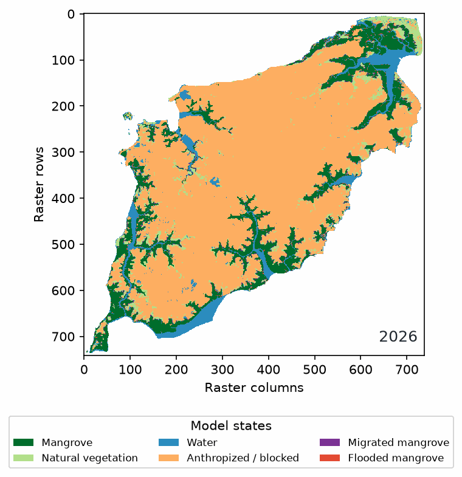

# BR-MANGUE Studio

[](https://github.com/oceanpep/br-mangue-studio/actions/workflows/tests.yml)
[](LICENSE)
[](CITATION.cff)

**BR-MANGUE Studio** is a desktop application for running and inspecting
spatial cellular-automaton scenarios of mangrove response to sea-level rise.
Use aligned land-cover and elevation rasters, set the scenario, and inspect
annual maps, trajectories, transitions, and reproducibility metadata.



*Software demonstration with raster data from Ilha de São Luís. This run has no
island boundary mask and is not a forecast or ecological validation.*

## Download

Choose a ready-to-run desktop build on the
[BR-MANGUE Studio download page](https://oceanpep.github.io/br-mangue-studio-site/downloads.html).
The executables include Python and the project's Python libraries. Your input
rasters, project files, and simulation results remain on your computer.

| Platform | Availability | Verified environment |
| --- | --- | --- |
| Windows 10/11, 64-bit | Stable 1.0.0 | Windows desktop release |
| Linux x86_64 | Research preview 1.0.0 | Built on Ubuntu 22.04 LTS; application startup verified on Ubuntu 26.04.1 LTS |

The Linux build needs a graphical desktop, compatible glibc libraries, and
`xdg-open` to open generated files and folders. Ubuntu 24.04, Linux Mint 22,
and Debian 13 are expected to work but have not been individually tested.
Alpine Linux and ARM64 are not supported by this build. See the download page
for the complete compatibility notes and checksums.

## What it does

- Reads categorical land-cover and elevation GeoTIFFs; soil-suitability and
  study-area mask rasters are optional.
- Lets you map source raster codes to model classes and record scenario
  parameters in a project.
- Provides continuous and persistent-block processing for different raster
  sizes and memory constraints.
- Exports annual state rasters, trajectory and transition tables, figures, and
  run metadata.
- Records timing and resource measurements to support repeatable analysis.

The standard desktop workflow uses the continuous or persistent-block engine.
DissModel is not required. The software supports scenario exploration; it does
not replace field data, calibration, or independent ecological validation.

## Quick start

1. Download the build for your operating system and open it. No separate
   Python installation is required for the packaged application.
2. Load a categorical land-cover raster and an elevation raster on the same
   grid. Add a suitability raster or study-area mask only when needed.
3. Review class mapping and scenario parameters, choose an engine, and run.
4. Inspect the annual maps, CSV tables, and `metadata.json` in the results
   folder.

The [quick-start guide](https://oceanpep.github.io/br-mangue-studio-site/guide.html)
explains the workflow and raster requirements.

## Install from source

Python 3.10 or newer is required. On Debian or Ubuntu, install Tk support and
create an isolated environment before installing the project:

```bash
sudo apt-get install python3-tk python3-venv
python3 -m venv .venv
.venv/bin/python -m pip install --upgrade pip
.venv/bin/python -m pip install -e .
.venv/bin/python -m brmangue_studio
```

The raster command-line runner is also available from the installed package.
For example:

```bash
python -m brmangue_lua.raster_cli \
  --mapbiomas /data/land_cover.tif \
  --elevation /data/elevation.tif \
  --initial-year 2025 --final-year 2050 \
  --engine blocks --block-size 10000 \
  --output outputs/example_run
```

Input names above are examples; data from any provider can be used when the
rasters are aligned and land-cover classes are categorical.

## Project map

| Path | Contents |
| --- | --- |
| `src/brmangue_studio/` | Desktop application and user interface |
| `src/brmangue_lua/` | Model rules, raster processing, and command-line runner |
| `tests/` | Automated checks for the model and raster workflow |
| `packaging/` | Windows and Linux executable build specifications |
| `.github/workflows/` | Continuous integration and Linux build workflow |
| `docs/` | User guide, API, benchmark records, and reproducibility notes |
| `paper.md`, `paper.bib` | JOSS-format software paper draft and references |

The documentation index at [`docs/README.md`](docs/README.md) points to the
right guide for each task.

## Research and reproducibility

Each run can include annual GeoTIFFs, `trajectory.csv`, transition tables,
resource samples, and `metadata.json`. The metadata records the input
configuration, engine, timing, and available resource measurements. Local
rasters and generated simulation products should not be committed unless their
license permits redistribution.

Benchmark records describe what was measured and its limits. In particular,
the archived Windows CMMA runs to 2100 used different class mappings, so their
runtime figures are separate observations rather than a controlled comparison
of engines.

- [Benchmark and test records](docs/benchmarks/)
- [Reproducibility and benchmarking protocol](docs/REPRODUCIBILITY_AND_BENCHMARKING.md)
- [JOSS paper draft](paper.md) and [submission readiness audit](docs/JOSS_READINESS.md)
- [Release and Zenodo checklist](docs/ZENODO_RELEASE.md)

## Development

Install in editable mode and run the existing test suite with:

```bash
python -m pip install -e . pytest
python -m pytest tests -q
```

The GitHub Actions workflow also runs the suite on Python 3.10, 3.11, and 3.12.
Please read [CONTRIBUTING.md](CONTRIBUTING.md) before proposing changes to
model rules, outputs, or performance measurements.

## Citation, license, and support

Cite the software release listed in [`CITATION.cff`](CITATION.cff). The
repository is distributed under the [MIT License](LICENSE). For reproducible
software issues, use the [issue tracker](https://github.com/oceanpep/br-mangue-studio/issues)
and follow the [support checklist](SUPPORT.md). Contributions follow the
[Code of Conduct](CODE_OF_CONDUCT.md).
